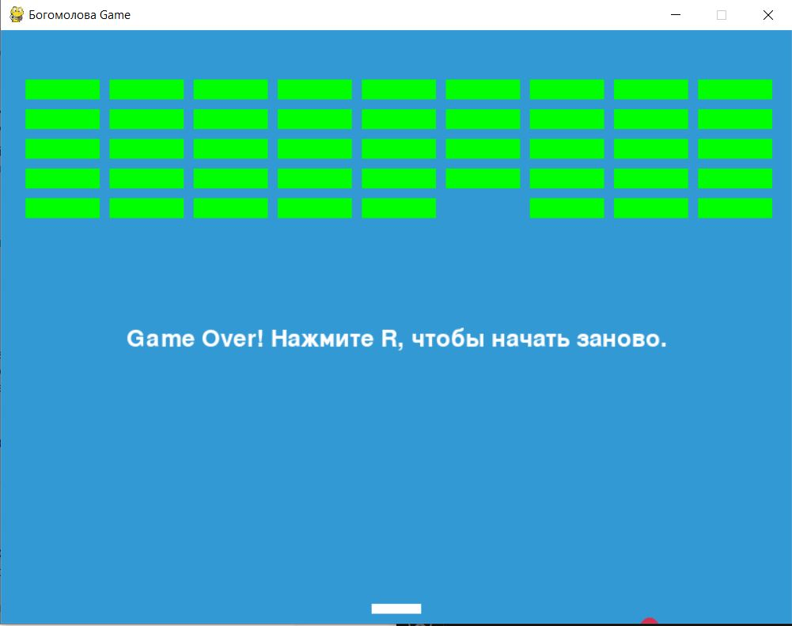

# ИГРА РАЗБЕЙ БЛОКИ
---
## Описание
Этот проект представляет собой простую игру "Разбей блоки", написанную на Python
## Установка 
- требуется Python 3
- У вас должна быть установлена библиотека pygame
## Правила 
Их нет!
## Управление 
- Для управления платформой используйте клавиши стрелок влево и вправо
- при проигрыше следуйте указаниям на экране 

